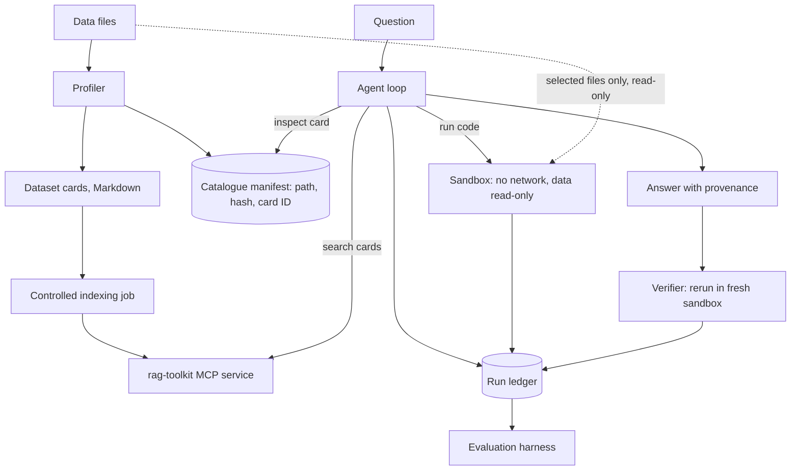

# Architecture

Status: proposed. Implement in the order given by the
[roadmap](implementation-plan.md).

## Scope

The system runs on one machine for one user. A user, or the evaluation harness,
asks a question about a data collection. The agent finds the relevant files,
analyses them in a sandbox, and returns an answer with provenance. The agent
owns the loop, the run ledger, and the answer. rag-toolkit supplies search over
dataset cards through MCP. The sandbox reads the raw files directly.



## Components

| Component | Responsibility | Initial implementation |
|---|---|---|
| Configuration | Model, endpoints, paths, budgets, sandbox limits | Validated settings file; no constants in code |
| Model client | Chat with tool calls, thinking level, token accounting | Interface with an Ollama implementation |
| Profiler | Deterministic dataset cards and manifest from raw files | Python; no LLM |
| Retrieval adapter | MCP lifecycle; turns search results into card references | Persistent stdio child process |
| Agent loop | Plan, search, inspect, write code, run, fix, answer | Bounded loop with injected interfaces; append-only, cache-stable context |
| Sandbox runner | Execute agent-written Python under isolation and limits | Persistent per-run kernel for exploration, fresh process for verification; technology decided in D3 |
| Run ledger | Every model turn, tool call, program, output, file hash | SQLite plus files under an ignored directory |
| Run replay | Render one run from the ledger for failure analysis | CLI over the ledger; read-only |
| Verifier | Rerun the final program, audit data-file reads, and compare the value | Same sandbox runner, fresh instance |
| Evaluation harness | Splits, conditions, scoring, reports | Local deterministic KramaBench variant; optional judged comparison |

## Agent tools

Proposed tools (none exist yet; the tool-call validation and repair policy in
`ds_research_agent/agent/tool_calls.py` does). At rag-toolkit `b7434cf` the MCP server
offers `rag_search`, `rag_list_corpora`, `rag_list_documents`,
`rag_read_document`, and `rag_find`. Only `rag_search` backs an agent tool;
`rag_list_documents` enumerates the whole catalogue and `rag_read_document`
bypasses the discovered-ID policy, so neither is exposed to the model.

| Tool | Does | Guard |
|---|---|---|
| `search_catalogue` | Searches dataset cards through `rag_search` | Corpus and filters fixed by the application |
| `read_card` | Returns one file or group card by catalogue ID | Manifest IDs already discovered in this run, or oracle IDs in the given-files condition |
| `run_python` | Accepts code and selected catalogue or group IDs; runs it in the run's persistent kernel; returns bounded stdout, stderr, and scratch artifacts | Validated file selection, isolated mounts, resource limits, trusted read auditing |
| `submit_answer` | Submits the value, claimed files, and a self-contained final program, using a schema per answer type | Schema validation; the program runs in a fresh sandbox, and one that fails or prints no answer line is returned for a fix (bounded); claims checked against runner observations; verifier runs next |

In the given-files condition, `search_catalogue` is disabled and the task's
labelled files are listed in the prompt. Only those raw files are exposed to
the sandbox; disabling the search tool alone is insufficient.

In the default end-to-end condition, search results add catalogue IDs to a
run-scoped discovered set. The agent selects IDs from that set in `run_python`;
the application resolves paths and constructs read-only mounts. Selection can
grow after further searches. Selecting a discovered group ID selects its
listed members, and the mount set expands to those files only. Each execution
records its allowed file set.
Neither `read_card` nor Python may enumerate the complete manifest or access
unselected raw files. Reject path traversal, symlink escapes, and guessed IDs.
Full-collection filesystem access is a separate evaluation condition, if added.

## Sandbox requirements

The agent runs code it wrote, against files that are untrusted input. The
sandbox must:

- Have no network access.
- Expose only the condition's selected raw files, read-only, with one writable
  scratch directory per run. Never mount the benchmark repository: workload
  answer keys, reference solutions, and gold sub-task material are evaluator-only.
- Limit CPU time, wall-clock time, memory, process count, and output size.
- Expose no host credentials, environment secrets, or home directory.
- Use a pinned image or environment with a recorded package list, so the
  verifier reruns under the same conditions. Derive the package list from the
  benchmark's file-type inventory (csv, xlsx, gpkg, json, npz, cdf, sp3, tle,
  and others found in D2); with no network, the agent cannot install a missing
  reader. Test that each inventoried format loads.
- Collect data-file read observations through a trusted runner-controlled
  mechanism outside agent control, covering native readers and child processes.
  An agent-written log or Python `open` wrapper alone is insufficient. D3 must
  demonstrate coverage for the supported execution environment; incomplete
  observations fail provenance verification. Record observation failures.
- Keep one persistent Python kernel per run for exploration, so parsed data
  survives between `run_python` calls. Read auditing covers the kernel for its
  whole life, not just individual calls. The verifier never reuses it. (Implemented as `KernelSession`: a trusted bridge relays cells over the
  container's stdio to a kernel traced for its whole life.)

The sandbox is a restricted Docker container (decided in D3; implemented in
`ds_research_agent/sandbox/`, with the persistent kernel). Container
defaults alone do not establish these properties; `tests/sandbox/` checks
them against real containers. A
plain subprocess on the host does not meet the requirements. On macOS, Docker
runs containers inside a Linux VM, so the read auditor (for example `strace -f`
or fanotify) runs inside that VM or container under runner control. The D0
spike's coverage and gaps are recorded in
[implementation-plan.md](implementation-plan.md#d0-progress).

## Agent execution

1. Load configuration and pin the catalogue generation and model settings for
   the run.
2. Give the model the question and the tools for the condition. Data file
   contents and card text are evidence, never instructions.
3. Keep the context cache-friendly: append-only within the run, with a
   byte-stable system prompt and tool schemas and no per-turn state in them.
   Earlier turns are never rewritten or summarised mid-run. Tool outputs are
   bounded by configuration, and tracebacks are trimmed to the relevant frames.
   See the measured latency in [implementation-plan.md](implementation-plan.md#measured-model-latency).
4. Record every model turn, tool call, program, output, and error in the run
   ledger. Enforce step, token, and wall-clock budgets. Repair malformed tool
   calls with a bounded, append-only retry (implemented in D0; see
   [D0 progress](implementation-plan.md#d0-progress)); record each retry. When the same error repeats,
   require the model to re-plan before running more code.
5. Before submitting, the agent checks its result for plausibility: magnitude,
   units, row counts after filtering, and nulls. This is the agent's own check,
   not verification.
6. Validate the submitted answer: schema, files that exist in the manifest,
   allowed selections, and a self-contained final program. Keep model file-use
   claims separate from the runner's observations.
7. Run the final program in a fresh sandbox with empty scratch, the recorded
   selected input snapshot, and the pinned environment. Check observed reads
   and hashes, then compare its structured output using the frozen reproduction
   comparator. The program must recreate intermediate artifacts from raw inputs.
   Missing observations or a mismatch fail provenance verification; the
   evaluator separately determines answer correctness.
8. Reaching a budget limit ends the run with a recorded reason. It never
   produces a guessed answer.

## Separation of responsibilities

Use MCP search rather than rag-toolkit's internal agent or `/chat`. This
project needs raw search results and control of its own loop. rag-toolkit's
turn logs and checks don't apply to MCP calls, so this project owns its
ledger and checks. Indexing is a separate job, never an agent tool.

The evaluator alone reads gold answers and reference material. It must not
feed scores or gold sub-task feedback into the agent's correction loop. Its
parser must not execute generated answer text on the host. Upstream judge
calls are isolated behind a separate opt-in scoring configuration.

## Proposed source layout

```text
ds_research_agent/
  config/           # validated settings
  models/           # model client interface, Ollama implementation
  catalogue/        # profiler, dataset cards, manifest
  retrieval/        # MCP client adapter
  sandbox/          # runner, persistent kernel, limits, image and package list
  agent/            # loop, tools, budgets, answer schemas per type
  provenance/       # run ledger, verifier
  interfaces/       # CLI, including run replay
eval/
  kramabench/       # fetch script, splits, scoring wrapper, conditions
  reports/          # report generation, failure-taxonomy counts
tests/              # offline checks
```

This tree is a plan, not existing code. Add packages as milestones need them.
